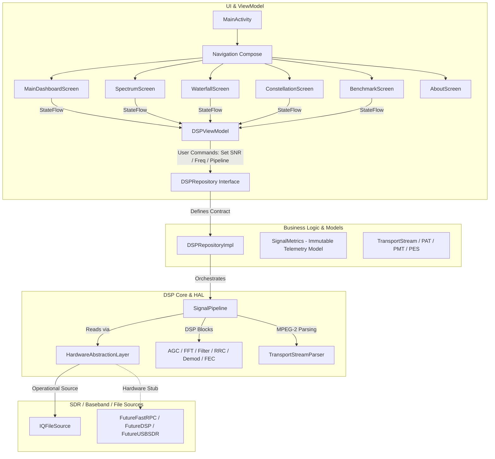

# GalaxyDSP Architectural Specification

GalaxyDSP adheres strictly to **Clean Architecture**, **MVVM (Model-View-ViewModel)**, and **SOLID** software design principles. The project is organized into modular layers that separate hardware interaction, digital signal processing, domain data modeling, repository orchestration, and UI rendering.

---

## 🏛️ Clean Architecture & MVVM Diagram

---

## 📐 SOLID Principle Compliance

1. **Single Responsibility Principle (SRP):**
   - `InputManager`: Sole responsibility is managing SIMD circular buffer reads from the attached `SignalSource`.
   - `OutputManager`: Sole responsibility is serializing demodulated MPEG-2 Transport Stream packets and publishing telemetry.
   - `DSPRepositoryImpl`: Coordinates DSP thread lifecycle and state dispatch without knowing Compose UI rendering details.

2. **Open/Closed Principle (OCP):**
   - New hardware RF frontends (e.g., custom USB SDRs or Qualcomm Hexagon cDSP nodes) can be added by implementing `HardwareSignalSource` without modifying `HardwareAbstractionLayer` or `SignalPipeline`.

3. **Liskov Substitution Principle (LSP):**
   - Any implementation of `SignalSourceInterface` can be substituted into `HardwareAbstractionLayer.attachSource()` seamlessly.

4. **Interface Segregation Principle (ISP):**
   - Signal sources implement segregated `SignalSourceInterface` (read-only sample streaming) distinct from `SignalSinkInterface` (write-capable DAC/transmit sinks).

5. **Dependency Inversion Principle (DIP):**
   - High-level ViewModels depend only on the abstract `DSPRepository` interface, injected via manual Dependency Injection (`AppContainer`).

---

## 🛡️ Exception Handling & Stability Guarantees

To ensure 24/7 uninterrupted receiver operation on embedded Android platforms:
- **No Force Unwrapping (`!!`):** All nullable types are safely unwrapped using `?:` Elvis operator fallback or safe calls.
- **Zero-Allocation Hot Loops:** In-place DSP operations (`FFT.transformInPlace()`, `AGC.processInPlace()`, `QPSKDemodulator.demodulateSoft()`) avoid heap allocation during active sample streaming.
- **Explicit Hardware Exception Reporting:** Hardware source stubs throw `DSPException.HardwareAbstractionException` with actionable descriptions rather than crashing the application or generating synthetic data.
