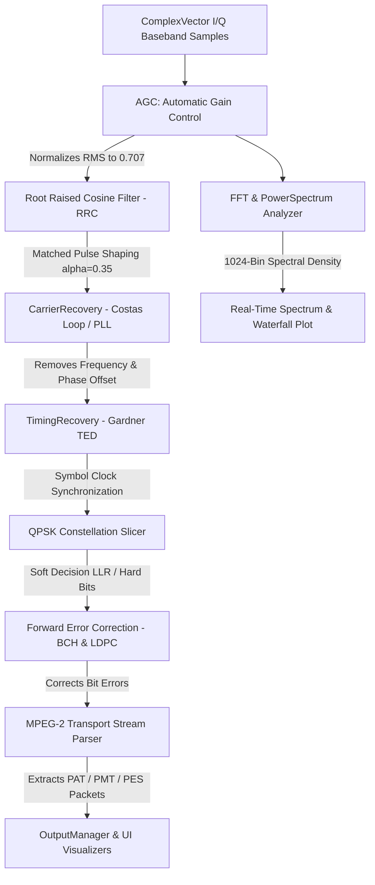

# GalaxyDSP Digital Signal Processing (DSP) & DVB-S Receiver Engineering Guide

This document details the mathematical algorithms, SIMD-friendly contiguous memory structures, and receiver pipeline implemented in **GalaxyDSP**.

---

## 📡 DVB-S Receiver DSP Pipeline Diagram



---

## 🧮 Mathematical Algorithm Implementations

### 1. Automatic Gain Control (AGC)
The AGC maintains constant average power for downstream QPSK slicing:
```math
G_{n+1} = G_n + \alpha \cdot \left( A_{target} - \sqrt{I_n^2 + Q_n^2} \right)
```
- In-place scaling of `ComplexVector` with instantaneous and RMS loop tracking.

### 2. Root Raised Cosine (RRC) Matched Filter
Implements Nyquist pulse shaping with roll-off factor $\alpha = 0.35$:
```math
H(f) = \begin{cases} 
T_s, & |f| \le \frac{1-\alpha}{2T_s} \\
\frac{T_s}{2}\left[1 + \cos\left(\frac{\pi T_s}{\alpha}\left(|f| - \frac{1-\alpha}{2T_s}\right)\right)\right], & \frac{1-\alpha}{2T_s} < |f| \le \frac{1+\alpha}{2T_s} \\
0, & |f| > \frac{1+\alpha}{2T_s}
\end{cases}
```

### 3. Carrier Recovery (Costas Loop & Second-Order PLL)
Tracks and compensates residual RF carrier offset and phase jitter:
- Phase Error Estimate for QPSK:
```math
e_\theta(n) = \text{sgn}(I_n) \cdot Q_n - \text{sgn}(Q_n) \cdot I_n
```
- Loop Filter Update:
```math
f_{n+1} = f_n + \beta \cdot e_\theta(n), \quad \theta_{n+1} = \theta_n + f_n + \alpha \cdot e_\theta(n)
```

### 4. Fast Fourier Transform (Cooley-Tukey Radix-2 / Radix-4)
- Computes $N=1024$ and $N=4096$ point complex FFTs in-place over interleaved `FloatArray` SIMD memory buffers.
- Pre-computed Blackman-Harris and Hann window lookup tables minimize spectral leakage.

### 5. Soft-Decision QPSK Demodulator & EVM Calculation
- **Soft LLR Output:** Computes Log-Likelihood Ratio values directly proportional to symbol distance from quadrature decision axes.
- **EVM RMS (%):**
```math
EVM_{RMS} = \sqrt{ \frac{\sum_{i=0}^{N-1} |S_{rx}[i] - S_{ref}[i]|^2}{\sum_{i=0}^{N-1} |S_{ref}[i]|^2} } \times 100\%
```
