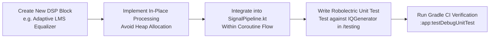

# GalaxyDSP Developer Guide

Welcome to the **GalaxyDSP** developer documentation. This guide explains how to extend the DSP pipeline, integrate real hardware SDR receivers, implement new DVB-S/DVB-S2 demodulation blocks, and run tests & benchmarks.

---

## 🧭 Engineering Standards & Philosophy

1. **Never Simplify or Use Placeholders:**
   - Every class must be fully implemented with mathematically correct algorithms.
   - Do not use `TODO`, pseudocode, or mock stubs in production paths.
2. **No Synthetic Data in Production:**
   - Generators like `IQGenerator`, AWGN noise, or simulated DVB-S streams belong strictly in `/testing` (e.g., `com.example.testing.IQGenerator`).
   - If no hardware or file source is attached, read operations must return `0` samples so the app reports **`"No Signal Source"`**.
3. **Null-Safety & Memory Discipline:**
   - Never use force unwrapping (`!!`).
   - Re-use `ComplexVector` and `FloatArray` buffers to prevent GC stalls in real-time audio/RF processing threads.

---

## 🛠️ Developer Workflow & Module Integration



---

## 🔌 Adding a New Hardware SDR Source

To add a new hardware receiver (for example, a custom USB RTL-SDR driver using LibUSB):

1. **Implement `HardwareSignalSource`:**
   ```kotlin
   class CustomRtlSdrSource(
       override val sampleRateHz: Float = 2_048_000f,
       override val centerFrequencyHz: Float = 1_200_000_000f
   ) : HardwareSignalSource {
       override val deviceName: String = "Custom RTL-SDR USB Receiver"
       override var isConnected: Boolean = false
           private set

       override fun connect() {
           // Open USB device via Android UsbManager & LibUSB endpoint
           // Throw DSPException.HardwareAbstractionException if permission denied or unplugged
       }

       override fun disconnect() {
           isConnected = false
       }

       override fun readSamples(destination: ComplexVector, maxSamples: Int): Int {
           // Read binary IQ samples from USB bulk endpoint into destination
           return samplesRead
       }
   }
   ```
2. **Attach to HAL:**
   - Pass your instance to `HardwareAbstractionLayer.attachSource(customRtlSdrSource)`.
   - The UI will automatically transition from `"No Signal Source"` to displaying live real-time Spectrum, Waterfall, and Constellation telemetry.

---

## 🧪 Testing & Continuous Integration

### 1. JVM Unit & Mathematical Tests
All core DSP algorithms are verified via JUnit 4 / Robolectric tests located in `/app/src/test/java/com/example/`:
- `DSPCoreTest.kt`: Validates FFT/IFFT energy conservation (Parseval's theorem), RMS AGC normalization, Costas loop frequency lock, and QPSK EVM accuracy.
- `TransportStreamTest.kt`: Verifies DVB-S MPEG-2 PAT, PMT, and PES packet parsing and continuity checking.

Run all unit tests locally:
```bash
gradle :app:testDebugUnitTest
```

### 2. Automated Benchmarks
GalaxyDSP includes a high-precision `BenchmarkEngine` capable of measuring throughput in **MSPS (Mega-Samples Per Second)** for:
- 1024-point Radix-2 FFT / IFFT
- Root Raised Cosine (RRC) 33-tap FIR filtering
- Soft-Decision QPSK Demodulator and LLR slicing
- Complete DVB-S Receiver Pipeline end-to-end latency

Run benchmarks from the UI by selecting the **Benchmark** tab on the tablet-optimized Material 3 dashboard.

### 3. GitHub Actions CI/CD Pipeline
The repository includes `.github/workflows/android.yml` which automatically:
- Executes Android Lint check (`gradle :app:lintDebug`)
- Runs JVM unit tests (`gradle :app:testDebugUnitTest`)
- Builds Debug and Release APKs (`gradle :app:assembleDebug`, `gradle :app:assembleRelease`)
- Uploads `GalaxyDSP-debug.apk` and `GalaxyDSP-release.apk` as downloadable GitHub Actions artifacts.
