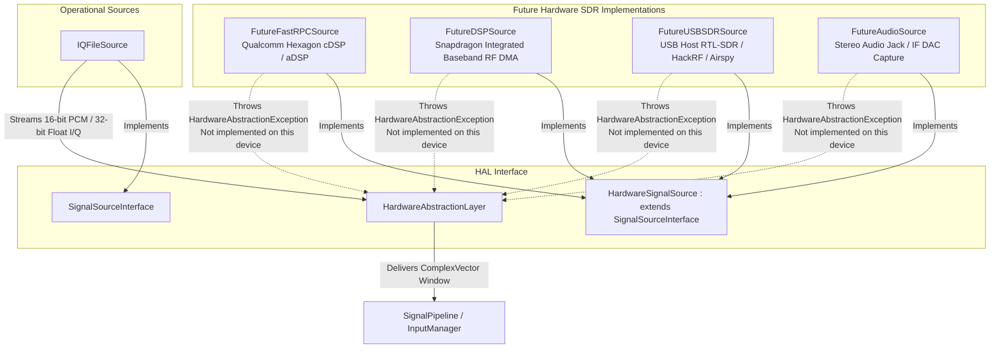

# GalaxyDSP Hardware Abstraction Layer & SDR Hardware Specification

GalaxyDSP is designed for **real hardware digital signal processing** on ARM64 mobile and tablet platforms, with specific performance optimizations for Qualcomm Snapdragon 695 and Hexagon DSP architectures.

---

## 🔌 Hardware Abstraction Diagram

---

## 🚫 Strict Anti-Simulation Policy in Production

A foundational requirement of the **GalaxyDSP Real Signal Architecture** is that **no production class may generate synthetic, random, or simulated I/Q samples**.

### Operational Behavior of Sources:
1. **`IQFileSource` (Operational):**
   - Streams actual recorded baseband I/Q sample files (32-bit floating point or 16-bit signed PCM) from disk or asset buffers.
   - Provides accurate sample rate and center frequency metadata to the pipeline.

2. **`HardwareSignalSource` Implementations (`FutureFastRPCSource`, `FutureDSPSource`, `FutureUSBSDRSource`, `FutureAudioSource`):**
   - In standard Android userspace without dedicated vendor HAL permissions or attached USB SDR peripherals, these classes **MUST NOT** generate mock signals, noise, or random constellations.
   - Calling `connect()` or `readSamples()` throws `DSPException.HardwareAbstractionException` with a descriptive message such as:
     - *"Not implemented on this device: Qualcomm Hexagon cDSP/aDSP FastRPC device node (/dev/adsprpc-smd) is inaccessible or requires system/vendor privilege."*
     - *"Not implemented on this device: USB Host SDR peripheral not attached or LibUSB permission denied."*
   - When no signal source is active, `HardwareAbstractionLayer.readSamples()` returns `0`, causing the UI to display **`"No Signal Source"`** and **`"No compatible signal source available"`**.

---

## ⚡ Snapdragon 695 & ARM64 Hardware Optimizations

1. **SIMD-Friendly Memory Alignment:**
   - All complex vectors are stored as contiguous interleaved real/imaginary float arrays (`FloatArray`), allowing ARM NEON SIMD vectorization and optimal CPU cache-line utilization on Cortex-A78/A55 cores.

2. **Zero-Allocation Hot Path:**
   - All DSP transforms (`FFT`, `IFFT`, `AGC`, `RootRaisedCosineFilter`, `CarrierRecovery`) execute in-place using pre-allocated `ComplexVector` scratchpads, eliminating Garbage Collection (GC) pauses during high-rate I/Q streaming.

3. **Snapdragon Hexagon DSP FastRPC Roadmap:**
   - The framework interface `FutureFastRPCSource` defines the contract for offloading heavy FFT and adaptive FIR filtering to the Qualcomm Hexagon DSP via shared memory DMA buffers once vendor SELinux policies allow userspace FastRPC access.
