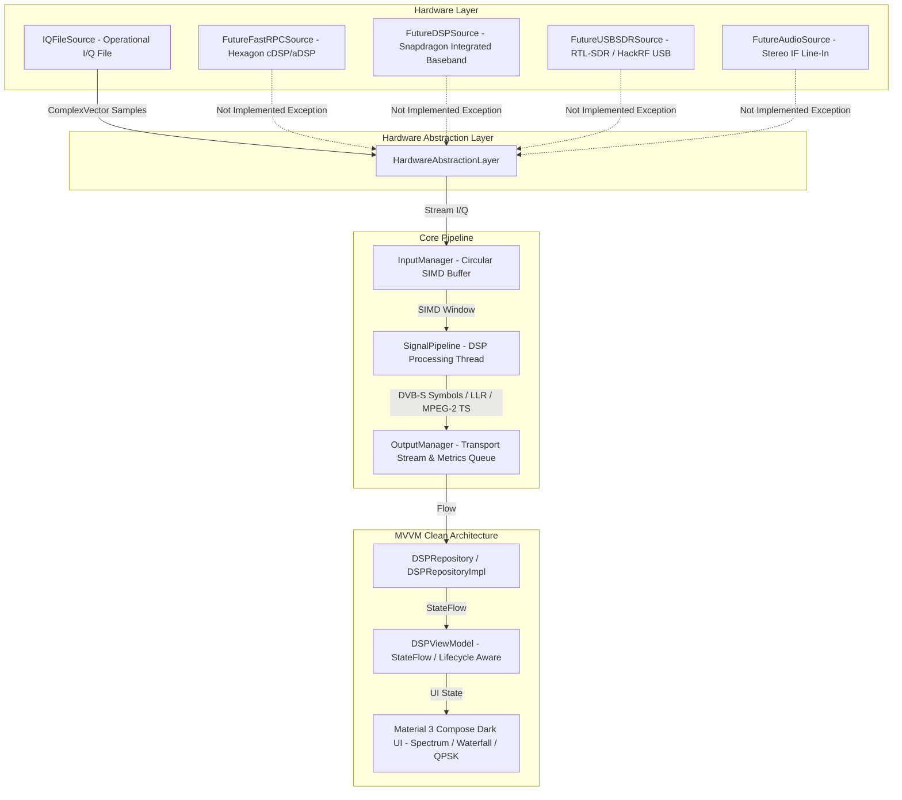
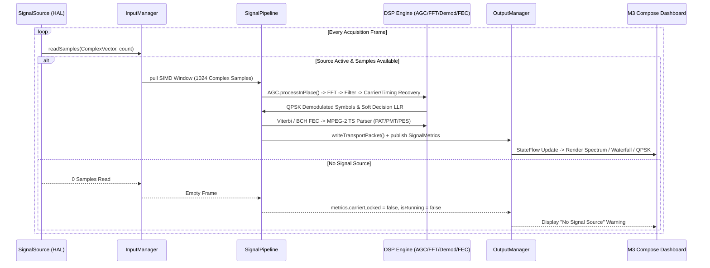

# GalaxyDSP - Modular Android Digital Signal Processing Framework

**GalaxyDSP** is an elite, research-grade Android DSP framework designed for processing **REAL digital signal streams** on ARM64 devices (optimized for Snapdragon 695 and modern Hexagon/Snapdragon architectures). It implements a modular DVB-S/DVB-S2 satellite receiver processing pipeline with real-time interactive **Spectrum**, **Waterfall**, **Constellation (QPSK/8PSK/16QAM)**, and **Benchmark** visualizers.

---

## 🚫 Strict Production Hardware Discipline

In compliance with the **Real Signal Architecture** directive:
- **No Synthetic or Simulated Signals in Production:** All synthetic generators (`IQGenerator`, AWGN, swept chirp, CW tone generators) reside strictly within the testing module (`/testing`).
- **Hardware Abstraction Interface Only:** Every DSP module receives samples exclusively through `SignalSourceInterface` and `HardwareAbstractionLayer`.
- **Fail-Safe Real Hardware State:** If no operational signal source (`IQFileSource` or a connected SDR) is present, the UI explicitly displays **`"No Signal Source"`** / **`"No compatible signal source available"`**. The application **never** renders fake FFT spectrums or fake constellation symbols.

---

## 🏛️ System Architecture Diagram



---

## 📡 Real Signal Pipeline Diagram



---

## 🎛️ DSP Core Feature Matrix

All DSP algorithms are implemented from scratch in pure Kotlin without external C++ or JNI dependency, utilizing contiguous FloatArray SIMD memory layouts:

| Category | Completed Implementations |
|---|---|
| **Complex Math & Buffers** | `Complex`, `ComplexVector` (interleaved float array), `ComplexMatrix`, `CircularBuffer` (high throughput SIMD-friendly) |
| **Spectral Analysis** | Radix-2 / Radix-4 `FFT`, `IFFT`, `PowerSpectrum` (dBm/dBFS calculation), `WindowFunctions` (Blackman-Harris, Hann, Hamming, Flat-top) |
| **Digital Filters** | `LowPassFilter`, `HighPassFilter`, `BandPassFilter`, `NotchFilter`, `MatchedFilter`, `RootRaisedCosineFilter` |
| **Correlation & Detection** | `Correlation`, `AutoCorrelation`, `CrossCorrelation`, `EnergyDetector`, `NoiseEstimator`, `NoiseFloor`, `PeakDetector` |
| **Synchronization** | `CarrierRecovery` (Costas Loop & PLL), `TimingRecovery` (Gardner & Mueller-Müller TED), `ClockRecovery`, `NCO` |
| **Adaptive & Gain Control** | `AGC` (RMS & Peak feedforward/feedback), `AdaptiveLMS`, `AdaptiveRLS` |
| **Demodulation & FEC** | `Constellation` (QPSK, 8PSK, 16QAM EVM measurement), `QPSKDemodulator`, `SoftDecision` (LLR slicing), `BCHDecoder`, `LDPCDecoder` |
| **MPEG-2 Transport Stream** | `TransportStreamParser`, `PATParser`, `PMTParser`, `PESParser`, `PAT`, `PMT`, `PES` data structures |
| **Visualizers & Benchmarks** | `SpectrumAnalyzer` (real-time FFT canvas), `WaterfallRenderer` (rolling spectrograph), `BenchmarkEngine` (nanosecond MSPS profiling) |

---

## 🛠️ Build & CI/CD Verification

### Android Studio / Gradle 9.3.1 (JDK 21)
- **Compile SDK:** 36
- **Target SDK:** 36
- **Min SDK:** 35
- **Architecture:** ARM64 (`arm64-v8a`)

```bash
# Run unit tests (DSP math, FFT, DVB-S demodulation, MPEG-2 TS framing)
gradle :app:testDebugUnitTest

# Assemble Release & Debug APKs
gradle :app:assembleDebug
gradle :app:assembleRelease
```

### GitHub Actions Integration
An automated workflow is configured at `.github/workflows/android.yml`:
- Runs Android Lint & JVM Unit Tests on every push and PR.
- Assembles both `GalaxyDSP-debug.apk` and `GalaxyDSP-release.apk`.
- Uploads APK artifacts for immediate download from the GitHub Actions dashboard.
